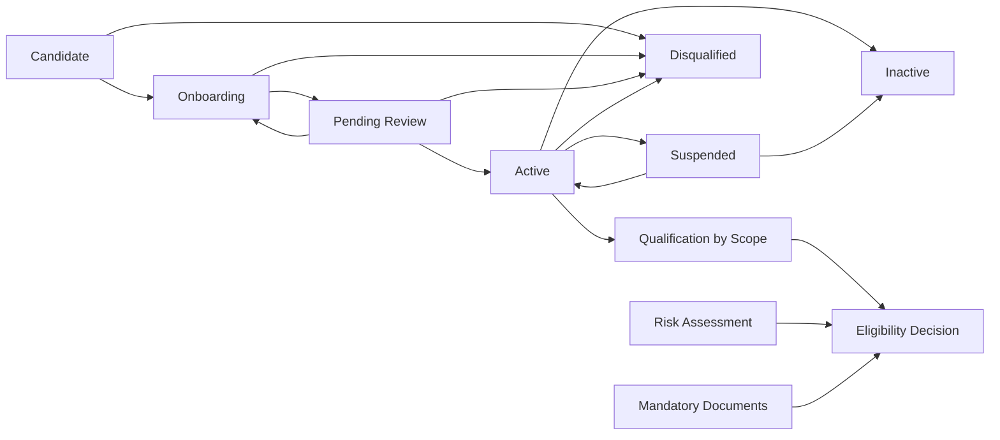

# Supplier Management — Ariba-inspired Implementation Plan

Ngày lập: 10/09/2026  
Repository: `supplier-new`  
Branch/commit được audit: `sonbn-glx` / `7bc925656137b7a35beac6b058f1e5981d838791`

## 1. Mục tiêu sản phẩm

Xây Supplier Management thành nguồn dữ liệu chuẩn cho ERP, ưu tiên ba năng lực:

1. Quản trị vòng đời nhà cung cấp từ Candidate đến Active, Suspended, Disqualified và Inactive.
2. Xác định NCC phù hợp theo phạm vi `Department × Region × Category` với qualification và classification có thời hạn.
3. Quản trị rủi ro theo NCC và theo phạm vi sử dụng, có assessment, control, issue, mitigation và lịch sử quyết định.

Thiết kế tham khảo cách SAP Ariba tổ chức Supplier Lifecycle and Performance, nhưng chỉ triển khai các năng lực phù hợp với ERP công ty. Không sao chép toàn bộ Ariba và không mở rộng sang PR, RFQ, PO, Invoice trong chương trình này.

## 2. Kết quả cần đạt

Sau khi hoàn thành, hệ thống phải trả lời được các câu hỏi sau bằng dữ liệu có truy vết:

- NCC hiện đang ở giai đoạn nào và vì sao?
- Ai yêu cầu tạo/kích hoạt/tạm ngưng NCC, ai phê duyệt và khi nào?
- NCC được phép cung cấp cho department nào, region nào và category nào?
- Qualification và classification có hiệu lực từ ngày nào đến ngày nào?
- Hồ sơ hoặc điều kiện nào sắp hết hạn?
- Rủi ro hiện tại là gì, owner là ai, control nào đang áp dụng và action nào quá hạn?
- Một department tại một region có được phép chọn NCC này tại thời điểm giao dịch không?
- Giá trị Golden Record trước và sau mỗi thay đổi là gì?
- Dữ liệu nào đã đồng bộ sang NAV/Vista, dữ liệu nào đang lỗi hoặc chờ xử lý?

## 3. Nguyên tắc kiến trúc

1. Giữ `vendor` làm Supplier Golden Record trong giai đoạn đầu để không phá UI và dữ liệu hiện tại.
2. Bổ sung bảng mới bằng migration tuần tự; không đổi tên hoặc xóa bảng hiện có trong cùng đợt.
3. Frontend không update trực tiếp trạng thái, qualification, classification, bank account hoặc risk decision.
4. Mọi thay đổi trọng yếu đi qua request → approval → materialization → audit trong một transaction.
5. Global lifecycle, scope qualification, scope classification và risk là bốn khái niệm riêng.
6. Không dùng `segment` toàn cục để thay thế classification theo department/region.
7. Không hard-code ngưỡng điểm, mức risk hoặc điều kiện phê duyệt trong JavaScript.
8. Không hard-delete dữ liệu lifecycle, qualification, classification, assessment, issue và audit.
9. Mọi bản ghi theo thời gian phải có `valid_from`, `valid_to`, `status` và owner/approver thích hợp.
10. Mọi policy phải fail closed: thiếu role hoặc thiếu mapping supplier thì không có quyền ghi/đọc dữ liệu nhạy cảm.

## 4. Mô hình nghiệp vụ mục tiêu



Lifecycle toàn cục chỉ mô tả khả năng tồn tại/giao dịch của NCC trong hệ thống. Quyền được sử dụng ở đâu được xác định qua scope:

```text
Supplier
  × Department
  × Region
  × Category
  × Effective Period
  → Qualification
  → Classification
  → Risk Decision
  → Eligibility Result
```

Mỗi dimension cần có một mã `ALL` rõ ràng. Không dùng `NULL` để ngầm hiểu “tất cả”, nhằm tránh logic unique và truy vấn không nhất quán.

## 5. State model

### 5.1 Global lifecycle

| Trạng thái | Ý nghĩa | Giao dịch mới |
|---|---|---:|
| `Candidate` | NCC tiềm năng, chưa onboarding | Không |
| `Onboarding` | Đang thu thập và kiểm tra hồ sơ | Không |
| `Pending_Review` | Hồ sơ đã submit, chờ quyết định | Không |
| `Active` | NCC được phép tồn tại trong hoạt động mua hàng | Phụ thuộc scope eligibility |
| `Suspended` | Tạm ngưng toàn cục | Không |
| `Inactive` | Ngừng hợp tác có kiểm soát | Không |
| `Disqualified` | Bị loại theo quyết định có lý do | Không |

Transition hợp lệ được lưu trong bảng cấu hình và thực thi tại backend. Ví dụ `Candidate → Active` không được phép đi thẳng.

### 5.2 Qualification theo scope

| Trạng thái | Ý nghĩa |
|---|---|
| `Not_Assessed` | Chưa đánh giá |
| `Pending` | Đang thu thập hoặc chờ review |
| `Qualified` | Đủ điều kiện trong scope và thời hạn xác định |
| `Conditional` | Được dùng với điều kiện/mitigation đã ghi nhận |
| `Disqualified` | Không đủ điều kiện trong scope |
| `Expired` | Qualification hết hạn |
| `Discontinued` | Chủ động dừng qualification |

### 5.3 Classification theo scope

Classification mô tả cách quản trị NCC; qualification mô tả có đủ điều kiện hay không. Danh mục tier phải cấu hình được, ví dụ `Strategic`, `Preferred`, `Approved`, `Transactional`, `Watchlist`. Không tạo enum cố định trước khi Procurement phê duyệt taxonomy.

### 5.4 Risk decision

| Quyết định | Ý nghĩa |
|---|---|
| `Acceptable` | Có thể sử dụng theo scope |
| `Accept_With_Controls` | Chỉ sử dụng khi control/condition còn hiệu lực |
| `Pending_Review` | Chưa đủ kết luận |
| `Blocked` | Không được sử dụng trong scope |

Risk score, risk level và risk decision là các giá trị khác nhau. Score không tự động biến thành quyết định nếu chưa có rule đã được phê duyệt.

## 6. Data model

### 6.1 Giữ và chuẩn hóa bảng hiện có

`vendor` tiếp tục là Supplier Golden Record trong v1. Bổ sung các cột quản trị nếu chưa tồn tại trong migration chuẩn:

- `lifecycle_status`
- `row_version`
- `data_owner_email`
- `last_approved_at`
- `last_approved_by`
- `source_system`
- `effective_from`
- `inactive_at`

Không xóa ngay `status`, `relationship`, `segment`, `sa_*` và `te_*`. Các field này được đánh dấu legacy sau khi dữ liệu đã migrate và UI đã chuyển sang model mới.

### 6.2 Reference data

| Bảng | Mục đích |
|---|---|
| `sm_department` | Department/cost center được phép sử dụng trong scope |
| `sm_region` | Region/market/area phục vụ qualification |
| `mdm_category` | Tái sử dụng cây category hiện có của Item Management |
| `sm_classification_tier` | Taxonomy phân loại NCC do Procurement cấu hình |
| `sm_risk_category` | Tax, Legal, Financial, Operational, Quality, Compliance, Continuity… |
| `sm_document_requirement` | Hồ sơ bắt buộc theo supplier type/category/scope |
| `sm_lifecycle_transition_rule` | Transition hợp lệ và role được quyết định |

### 6.3 Lifecycle và approval

| Bảng | Trường chính |
|---|---|
| `sm_supplier_request` | `request_no`, `supplier_id`, `request_type`, `status`, `proposed_payload`, `submission_key`, `requested_by`, `current_owner`, timestamps |
| `sm_supplier_request_decision` | `request_id`, `decision`, `reason`, `decided_by`, `decided_at`, approval step |
| `sm_supplier_lifecycle_history` | from/to status, effective date, request, actor, reason |
| `sm_supplier_change_snapshot` | before/after JSON, changed fields, source request |

Request types v1:

- `Create_Supplier`
- `Submit_Onboarding`
- `Activate_Supplier`
- `Update_Profile`
- `Change_Bank_Account`
- `Suspend_Supplier`
- `Reinstate_Supplier`
- `Disqualify_Supplier`
- `Inactivate_Supplier`

### 6.4 Scope, qualification và classification

| Bảng | Trường chính |
|---|---|
| `sm_supplier_scope` | supplier, department, region, category, owner, active flag |
| `sm_supplier_qualification` | scope, status, valid from/to, assessment/evidence, conditions, approved by/at |
| `sm_supplier_classification` | scope, tier, rationale, valid from/to, approved by/at |
| `sm_supplier_scope_history` | before/after, event, request, actor, timestamp |

Unique key của scope:

```text
(supplier_id, department_id, region_id, category_id)
```

Không ghi đè qualification/classification cũ. Khi thay đổi, đóng `valid_to` của bản đang hiệu lực và tạo phiên bản mới.

### 6.5 Risk

| Bảng | Mục đích |
|---|---|
| `sm_risk_assessment` | Một lần đánh giá rủi ro cho supplier hoặc scope |
| `sm_risk_factor` | Từng risk observation/factor, probability, impact, evidence |
| `sm_risk_control` | Control bắt buộc, owner, effectiveness, review/expiry date |
| `sm_risk_issue` | Issue phát hiện, severity, status, assignee, due date |
| `sm_risk_action` | Mitigation/CAPA, owner, due date, completion evidence |
| `sm_risk_decision` | Acceptable/Conditional/Pending/Blocked theo supplier hoặc scope |
| `sm_risk_model_version` | Phiên bản công thức/threshold đã được phê duyệt |

Risk v1 ưu tiên:

- Tax/legal status.
- Financial capacity.
- Mandatory document/certificate expiry.
- Operational capacity và lead time.
- Quality/delivery performance khi dữ liệu có sẵn.
- Concentration/dependency.
- Business continuity.

Không tự động coi “thiếu dữ liệu” là điểm 0. Phải có trạng thái `Unknown` hoặc `Not_Assessed`.

### 6.6 Document và questionnaire

| Bảng | Mục đích |
|---|---|
| `sm_supplier_document` | Phiên bản tài liệu, issuer, document number, validity, storage path |
| `sm_questionnaire_template` | Bộ câu hỏi có version và phạm vi áp dụng |
| `sm_questionnaire_question` | Câu hỏi, answer type, required, weight, evidence requirement |
| `sm_questionnaire_instance` | Lần gửi questionnaire cho supplier/internal reviewer |
| `sm_questionnaire_response` | Câu trả lời, attachment, respondent, submitted at |

`vendor_document` hiện tại được giữ để tương thích. Dữ liệu sẽ được migrate sang `sm_supplier_document`; view tương thích có thể cung cấp shape cũ cho UI trong giai đoạn chuyển đổi.

### 6.7 Audit và downstream

| Bảng | Mục đích |
|---|---|
| `sm_supplier_audit_event` | Append-only audit với before/after và correlation/request ID |
| `sm_supplier_outbox` | Transactional outbox cho Supplier Master và scope decision |
| `sm_supplier_crosswalk` | Supplier/Site ↔ NAV/Vista external ID |
| `sm_supplier_sync_audit` | Claim, dispatch, retry, response và reconciliation |

Tái sử dụng pattern của `mdm_downstream_outbox`; không gọi NAV/Vista trực tiếp từ trình duyệt.

## 7. Eligibility service

Tạo RPC duy nhất để các module sau này hỏi “NCC này có dùng được không?”:

```text
sm_check_supplier_eligibility(
  supplier_id,
  department_id,
  region_id,
  category_id,
  as_of_date
)
```

Output đề xuất:

```json
{
  "eligible": false,
  "lifecycle_status": "Active",
  "qualification_status": "Conditional",
  "classification_tier": "Preferred",
  "risk_decision": "Pending_Review",
  "blocking_reasons": ["RISK_REVIEW_PENDING"],
  "warnings": ["CERTIFICATE_EXPIRES_IN_20_DAYS"],
  "effective_scope_id": "...",
  "evaluated_at": "...",
  "policy_version": "..."
}
```

Thứ tự quyết định:

1. Global lifecycle có cho phép giao dịch không?
2. Có scope khớp chính xác hoặc scope `ALL` hợp lệ không?
3. Qualification có hiệu lực không?
4. Mandatory documents có hợp lệ không?
5. Risk decision có block hoặc yêu cầu control không?
6. Điều kiện của `Conditional` đã được đáp ứng chưa?

Classification không tự quyết định eligibility; nó phục vụ ưu tiên, chiến lược và governance.

## 8. Phân quyền và segregation of duties

| Role | Năng lực chính |
|---|---|
| `Viewer` | Đọc dữ liệu được phân quyền |
| `Buyer` | Đề nghị tạo/cập nhật NCC và qualification scope |
| `Supplier_Manager` | Quản trị onboarding, hồ sơ và lifecycle request |
| `Risk_Reviewer` | Assessment, control, issue và risk recommendation |
| `Accounting` | Xác minh tax/bank/posting data; không tự kích hoạt NCC |
| `Approver` | Quyết định lifecycle, qualification và classification theo scope được giao |
| `Admin` | Cấu hình reference/policy; không mặc định là người duyệt nghiệp vụ |
| `Supplier_User` | Chỉ xem/cập nhật questionnaire và hồ sơ của chính NCC |

Quy tắc bắt buộc:

- Requester không tự duyệt request của mình.
- Người xác minh bank data không được là supplier user hoặc requester thay đổi bank.
- Supplier user không đọc được supplier, RFQ hoặc PO của NCC khác.
- Admin kỹ thuật không tự động có quyền business approval nếu không được gán role.
- Mọi kiểm tra nằm trong RLS/RPC; ẩn nút trên UI chỉ là trải nghiệm hiển thị.

## 9. API/RPC boundary

Các RPC v1:

- `sm_submit_supplier_request(...)`
- `sm_decide_supplier_request(...)`
- `sm_withdraw_supplier_request(...)`
- `sm_set_scope_qualification(...)`
- `sm_set_scope_classification(...)`
- `sm_create_risk_assessment(...)`
- `sm_record_risk_decision(...)`
- `sm_create_risk_issue(...)`
- `sm_update_risk_action(...)`
- `sm_check_supplier_eligibility(...)`
- `sm_upsert_supplier_crosswalk(...)`
- `sm_retry_supplier_sync_event(...)`

Direct DML từ `authenticated` vào canonical lifecycle, qualification, classification, risk decision và audit tables phải bị revoke. RPC dùng `security definer`, fixed `search_path`, xác minh JWT/role và kiểm tra state transition.

Mọi mutation nhận `submission_key` hoặc `idempotency_key` và `expected_row_version` để chống gửi trùng và lost update.

## 10. UI mục tiêu

Không viết lại toàn bộ `index.html` trong một lần. Tách dần thành module và giữ hành vi đang dùng.

### Supplier 360

- Summary: lifecycle, registration, qualification count, preferred scopes, overall risk, ERP sync.
- Organization: pháp nhân, địa chỉ/site, tax, identifiers, contacts.
- Qualification & Classification: ma trận Department × Region × Category.
- Risk: assessment, risk factors, controls, issues, actions và review dates.
- Documents: certificate/document versions và expiry.
- Questionnaires: assigned, in progress, submitted, approved/rejected.
- History: lifecycle, profile changes, decisions và before/after.
- Integration: crosswalk và outbox status.

### Work queues

- My onboarding tasks.
- Qualification requests waiting for review.
- Risk reviews and overdue actions.
- Documents expiring.
- Profile/bank changes waiting for approval.
- Sync events requiring intervention.

## 11. Data migration

### 11.1 Nguyên tắc

- Backup và chụp row count/hash trước migration.
- Không xóa hoặc sửa mất dữ liệu legacy.
- Migration idempotent và có reconciliation view.
- Giá trị không đủ bằng chứng chuyển thành `Needs_Review`, không tự suy diễn thành Approved/Qualified.
- Cutover qua dual-read rồi chuyển write path; không đổi toàn bộ UI cùng lúc.

### 11.2 Mapping dữ liệu hiện tại

| Dữ liệu hiện tại | Mapping đề xuất |
|---|---|
| `vendor.status` + `relationship` | Global lifecycle candidate; trường hợp mâu thuẫn đưa vào reconciliation queue |
| `vendor.segment` | Legacy classification với scope `ALL × ALL × ALL`, trạng thái `Needs_Review` |
| `vendor.cat` | Category suggestion; chỉ map khi code/category xác minh được |
| `sa_*` | Legacy evaluation summary; không coi là scorecard đầy đủ |
| `te_*` | Legacy qualification evidence; không tự tạo Qualified nếu thiếu scope/approval |
| `vendor_document` | Document version đầu tiên, giữ storage path và metadata |
| `tax_risk_registry` | Risk observation nguồn Tax Registry; không tự block NCC |
| `vendor_bank_change` | Import request/history nếu schema live tồn tại và đối soát được |
| `vendor_audit` | Legacy audit event; đánh dấu source là `LEGACY_CLIENT_AUDIT` |

### 11.3 Reconciliation bắt buộc

- Mỗi vendor cũ có đúng một Supplier Golden Record.
- Không mất contact, document hoặc alias.
- Mọi status/relationship combination được map hoặc xuất hiện trong exception report.
- Tổng file storage có record tương ứng và ngược lại.
- Không có hai qualification đang hiệu lực cho cùng scope.
- Không có hai classification đang hiệu lực cho cùng tier type/scope.

## 12. Implementation roadmap

### Phase 0 — Baseline và security containment

Mục tiêu: repository tái lập được database và không còn lỗ hổng quyền nghiêm trọng.

Checklist:

- Lấy schema dump của Supabase target đã được owner xác nhận.
- So sánh live schema với migrations và các SQL vá rời.
- Đưa mọi object cần thiết vào migration tuần tự mới; không sửa migration đã chạy production.
- Tắt `LOADING_MODE`; đưa maker-checker xuống database.
- Sửa RLS `vendor`, contact, document, bank change, role và portal mapping.
- RLS Supplier Portal dựa trên `auth.email → app_supplier → supplier_id`.
- Edge Functions fail closed khi thiếu admin configuration.
- Tạo role/RLS integration tests trên Supabase/Postgres staging.

Exit criteria:

- Database trống dựng được bằng migrations.
- Buyer/Viewer không update trực tiếp Golden Record.
- Supplier A không đọc/sửa được dữ liệu Supplier B.
- Maker không thể tự approve bằng UI hoặc API.

### Phase 1 — Supplier lifecycle foundation

Mục tiêu: toàn bộ lifecycle đi qua request/approval có audit.

Checklist:

- Tạo request, decision, history và snapshot tables.
- Tạo lifecycle transition rules.
- Tạo submit/decide/withdraw RPC với idempotency và row version.
- Chuyển create, activate, suspend, reinstate, disqualify, inactivate sang RPC.
- Chuyển thay đổi critical profile/bank/posting fields sang change request.
- Tạo Supplier 360 summary và lifecycle timeline.
- Feature-flag đường update trực tiếp cũ rồi loại bỏ sau cutover.

Exit criteria:

- Không có đường update trực tiếp lifecycle từ browser.
- Mọi transition có request, decision, reason, actor, timestamp và before/after.
- Concurrent decisions không tạo hai trạng thái kết quả.

### Phase 2 — Department × Region × Category scope

Mục tiêu: hệ thống quyết định được NCC phù hợp cho từng phạm vi.

Checklist:

- Chuẩn hóa master Department, Region và Category; tạo mã `ALL`.
- Tạo `sm_supplier_scope`.
- Tạo qualification và classification versioned/effective-dated.
- Xây UI matrix và filter theo Department/Region/Category.
- Xây qualification request/approval.
- Xây classification request/approval.
- Xây `sm_check_supplier_eligibility` và reason codes.
- Tạo expiry job/heartbeat cho qualification sắp hết hạn.

Exit criteria:

- Cùng một NCC có thể Qualified ở scope A và Disqualified ở scope B.
- Query tại một ngày quá khứ trả đúng phiên bản có hiệu lực lúc đó.
- Không có overlapping effective periods trong cùng scope.
- Eligibility trả nguyên nhân block/warning có thể kiểm chứng.

### Phase 3 — Supplier risk management

Mục tiêu: risk được quản lý thành assessment và action, không chỉ là cảnh báo màn hình.

Checklist:

- Procurement phê duyệt risk taxonomy và owner matrix.
- Tạo assessment, factor, control, issue, action, decision và model version.
- Chuyển tax risk, document expiry và capital exposure thành observations có source/evidence.
- Hỗ trợ risk theo global supplier hoặc scope.
- Tạo review schedule, due date, escalation và overdue queue.
- Tạo risk summary trên Supplier 360.
- Kết nối risk decision với eligibility service.

Exit criteria:

- Mỗi risk có nguồn, assessment date, owner và review date.
- `Blocked` hoặc `Accept_With_Controls` có decision maker và rationale.
- Control/action hết hạn làm eligibility trả warning/block theo policy version đã duyệt.
- Không dùng dữ liệu thiếu để tự gán điểm 0.

### Phase 4 — Onboarding questionnaire và certificate

Mục tiêu: onboarding/qualification có bằng chứng cấu hình được.

Checklist:

- Tạo questionnaire template/version và conditional questions.
- Tạo document requirements theo supplier type/category/scope.
- Cho Supplier Portal trả lời, upload và resubmit.
- Profile change giữ giá trị approved trước đó cho đến khi thay đổi được duyệt.
- Certificate validity/expiry/renewal workflow.
- Internal reviewer và supplier respondent được tách role.

Exit criteria:

- Questionnaire version cũ vẫn truy xuất được.
- Rejected change không ghi đè approved Golden Record.
- Qualification chỉ tham chiếu evidence đã submit/approve.

### Phase 5 — Supplier performance và corrective action

Mục tiêu: chuyển SA hiện tại thành chương trình đánh giá có cấu trúc.

Checklist:

- KPI/KI dictionary, formula, data source, frequency và owner.
- Questionnaire/scorecard template theo scope.
- Evaluation program và participant assignments.
- Scoring bands có version.
- Import on-time/fill-rate từ nguồn giao dịch đã xác minh.
- Issue/CAPA từ kết quả performance thấp.

Exit criteria:

- Mỗi score truy ngược được về câu trả lời hoặc nguồn dữ liệu.
- Scorecard theo kỳ và scope không ghi đè lịch sử.
- KPI thiếu dữ liệu hiện `Unknown`, không hiện 0.

### Phase 6 — Supplier downstream và operational readiness

Mục tiêu: Supplier Master và scope decisions đồng bộ an toàn với ERP.

Checklist:

- Supplier/Site crosswalk NAV/Vista.
- Transactional outbox trong cùng transaction approval.
- Worker claim/complete, retry, idempotency và reconciliation.
- Monitoring, alert, owner và runbook.
- Migration rehearsal, rollback drill và UAT theo role.

Exit criteria:

- Approved change tạo đúng một outbox event.
- Missing crosswalk tạo `Blocked`, không đoán external ID.
- Staging reconciliation và rollback drill pass.

## 13. Test strategy

### Database contract tests

- Migration from empty.
- Migration từ snapshot có dữ liệu legacy.
- Unique/effective-period constraints.
- Invalid lifecycle transition bị từ chối.
- Direct canonical write bị từ chối.
- Idempotent submit/approve.
- Optimistic locking.

### RLS matrix tests

- Buyer, Supplier Manager, Risk Reviewer, Accounting, Approver, Admin, Viewer.
- Supplier A versus Supplier B.
- Department/Region-scoped approver.
- Missing role và missing portal mapping.

### Business tests

- Candidate → Onboarding → Pending → Active.
- Reject và resubmit không làm mất bản approved.
- Suspend global block mọi scope.
- Qualified scope A không mở scope B.
- Qualification hết hạn.
- Conditional qualification với control.
- Risk Blocked override eligibility.
- Overlapping effective periods bị từ chối.
- Change bank account maker-checker.

### Audit tests

- Mọi approved mutation có before/after, actor, request và timestamp.
- Audit failure làm transaction nghiệp vụ rollback.
- User thường không update/delete audit event.

## 14. Approval gates

### Gate A — Business model approval

Procurement phê duyệt:

- Global lifecycle states và transition.
- Department/Region/Category master owners.
- Qualification statuses và validity rules.
- Classification taxonomy.
- Risk taxonomy, decision levels và owner matrix.

### Gate B — Security and schema approval

IT/Security/Data Owner phê duyệt:

- Canonical schema và PII classification.
- Role/RLS matrix.
- Supplier Portal isolation.
- Retention, audit và attachment policy.

### Gate C — Migration approval

Owner phê duyệt:

- Legacy mapping rules.
- Exception list.
- Reconciliation counts.
- Backup và rollback procedure.

### Gate D — Pilot/cutover approval

Chỉ cutover khi:

- Critical RLS/state-transition tests pass.
- Không còn unmapped Active supplier quan trọng.
- Scope eligibility UAT pass với ít nhất hai Department và hai Region.
- Risk workflow và escalation có owner.
- NAV/Vista reconciliation đạt tiêu chí đã duyệt.

## 15. Backlog ưu tiên đầu tiên

Thứ tự thực thi ngay trên repo:

1. Schema reconciliation và migration inventory.
2. RLS containment cho `vendor`, `app_supplier`, document và bank data.
3. Tắt `LOADING_MODE`, thêm backend maker-checker.
4. `sm_supplier_request` + decision/history/snapshot.
5. Lifecycle transition RPC.
6. Department/Region reference master.
7. Supplier scope + qualification/classification tables.
8. Eligibility RPC và reason codes.
9. Risk taxonomy + assessment/control/issue/action.
10. Supplier 360 UI và work queues.

Không bắt đầu questionnaire builder hoặc performance scorecard trước khi 8 mục đầu đã đạt exit criteria.

## 16. Definition of Done cho chương trình

- Repository dựng được database đầy đủ từ migration.
- Supplier Golden Record không còn đường ghi trực tiếp trái phép.
- Global lifecycle và scope eligibility hoạt động độc lập, nhất quán.
- Department × Region × Category được effective-date và version đầy đủ.
- Risk có assessment, decision, control, issue và action có owner.
- Supplier Portal được cô lập theo supplier identity.
- Mọi quyết định truy vết được đến request, evidence, approver và policy version.
- Không mất lịch sử khi update, suspend, disqualify hoặc inactivate.
- Supplier downstream sử dụng outbox/crosswalk/reconciliation.
- Database, RLS, workflow, audit, migration và UAT tests đạt tiêu chí đã duyệt.
